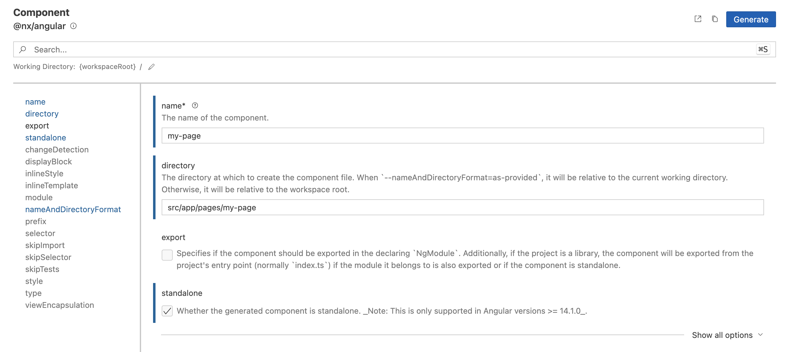
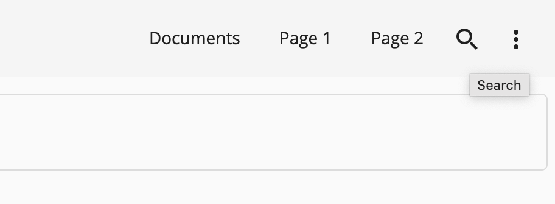

# Customizing

The recommended configuration entry points are as following:

- `src/app/app.header.ts` - custom application menu entries
- `src/app/app.sidebar.ts` - custom navigation sidebar entries
- `src/app/app.routes.ts` - application routes
- `src/app/pages/*` - main content pages, add your components here or modify the existing examples
- `src/app.config.json` - main configuration file for ADF components
- `src/app.theme.scss` - application theme

## Creating a Page

You can use Nx schematics to generate a standalone Angular component:



Alternatively, the command-line equivalent should look like the following:

```sh
npx nx generate @nx/angular:component --name=my-page --directory=src/app/pages/my-page --standalone=true --nameAndDirectoryFormat=as-provided --no-interactive


>  NX  Generating @nx/angular:component

CREATE src/app/pages/my-page/my-page.component.css
CREATE src/app/pages/my-page/my-page.component.html
CREATE src/app/pages/my-page/my-page.component.spec.ts
CREATE src/app/pages/my-page/my-page.component.ts
```

## Mapping the Page to a Route

Update the `src/app/app.routes.ts` if you want to map your Page component to Route:

```ts
// ...
import { MyPageComponent } from './pages/my-page/my-page.component';

export const appRoutes: Routes = [
  // ...
  {
    path: 'my-page',
    component: MyPageComponent
  }
];
```

## Displaying a Route in the Sidebar

Update the `src/app/app.sidebar.ts` file, to provide a custom Sidebar entry:

```ts
import { AppSidebarEntry } from '@app/sdk';

export const appSidebarEntries: Array<AppSidebarEntry> = [
  // ...
  {
    text: 'My Page',
    path: '/my-page',
    icon: 'assignment'
  }
];
```

At the runtime, it gives the following result:


## Displaying a Route in the Application Header

Update the `src/app/app.header.ts` file, to provide a custom Application Header entry:

```ts
import { AppHeaderEntry } from '@app/sdk';

export const appHeaderEntries: Array<AppHeaderEntry> = [
  // ...
  {
    text: 'My Page',
    path: '/my-page'
  }
];
```

Which gives the following result at the runtime:


You can also display menu entry as an icon button:

```ts
{
  text: "Search",
  path: "/search",
  icon: "search"
}
```

In this case, the `text` value becomes the button tooltip, and only icon displayed:



## Custom Page Layouts

You can control if your custom page has generic layout or a fully custom one.

Once you click the newly introduced "My Page" link, the component is taking the whole page:


In the `src/app/app.routes.ts`, make your entry a child of the route backed by the `AppLayoutComponent`:

```ts
export const appRoutes: Routes = [
  // ...
  {
    path: '',
    component: AppLayoutComponent,
    children: [
      {
        path: '',
        component: HomeComponent
      },
      {
        path: 'home',
        component: HomeComponent
      },
      {
        path: 'documents',
        component: DocumentsComponent,
        canActivate: [AuthGuardEcm]
      },
      {
        path: 'page1',
        component: Page1Component
      },
      {
        path: 'page2',
        component: Page2Component
      },
      // Move the entry here
      {
        path: 'my-page',
        component: MyPageComponent
      }
    ]
  }
  // ...
];
```

Upon navigation, the page should be looking like the following now:


