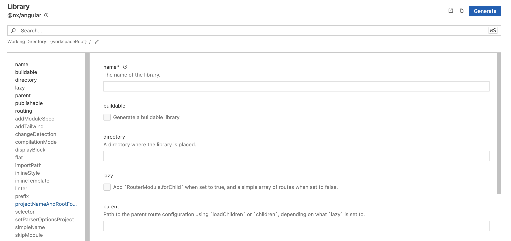
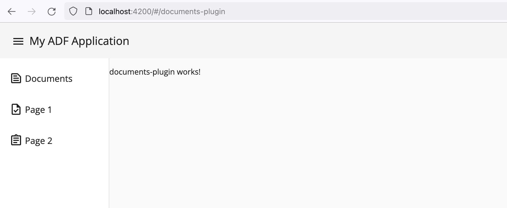

## Plugin Libraries

To generate a library, you can use Nx Console for the VS Code or IntelliJ:

- [Nx for VS Code](https://marketplace.visualstudio.com/items?itemName=nrwl.angular-console)
- [Nx for IntelliJ](https://plugins.jetbrains.com/plugin/21060-nx-console)



To create a minimal library called `documents-plugin`, use the following options:

- **name**: `documents-plugin`
- **buildable**: `true`
- **directory**: `plugins/documents-plugin`
- **lazy**: `true`
- **parent**: `src/app/app.routes.ts`
- **routing**: `true`
- **skipTests** (optional): `true`
- **standalone**: `true`
- **strict** (optional): `true`
- **unitTestRunner** (optional): `none`

Alternatively, execute the following from the command line:

```sh
npx nx generate @nx/angular:library \
  --name=documents-plugin \
  --buildable=true \
  --directory=plugins/documents-plugin \
  --lazy=true \
  --parent=src/app/app.routes.ts \
  --routing=true \
  --projectNameAndRootFormat=as-provided \
  --skipTests=true \
  --standalone=true \
  --unitTestRunner=none \
  --no-interactive
```

### Integrating with Routes

The schematics library is going to update the `src/app/app.routes.ts` with the following entry:

```ts
{ 
  path: 'documents-plugin', 
  loadChildren: () => import('documents-plugin').then((m) => m.documentsPluginRoutes) 
},
```

If using application layouts, move the newly added route to the corresponding place.

Start the application and navigate to the <http://localhost:4200/#/documents-plugin> to see your content up and running:



See [Customizing](./customizing.md) section for more details on basic integration with Sidebar and Application Menu.
